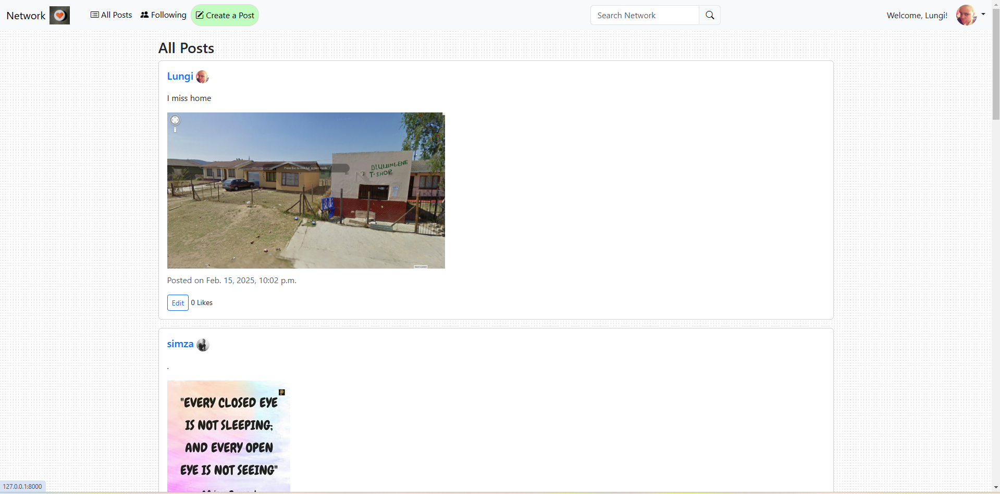
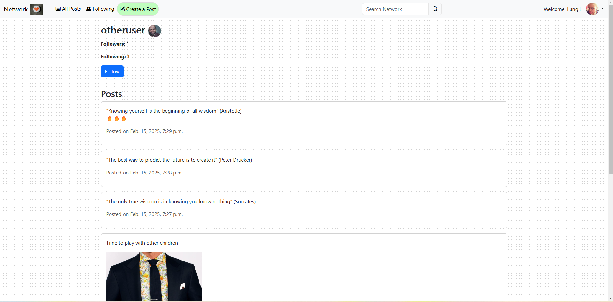
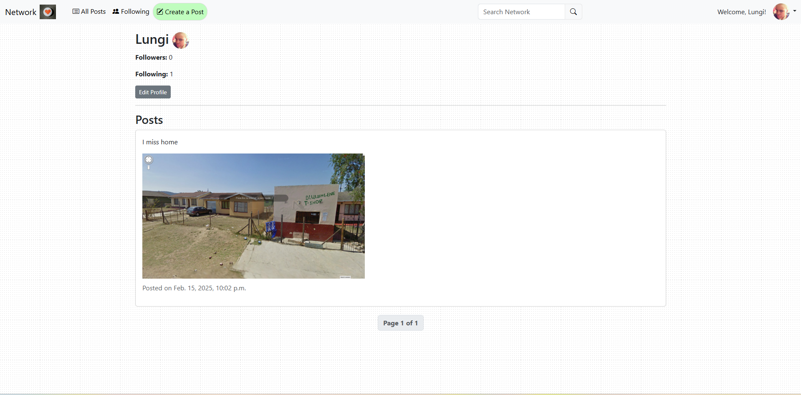
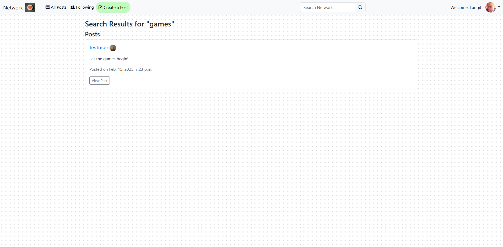
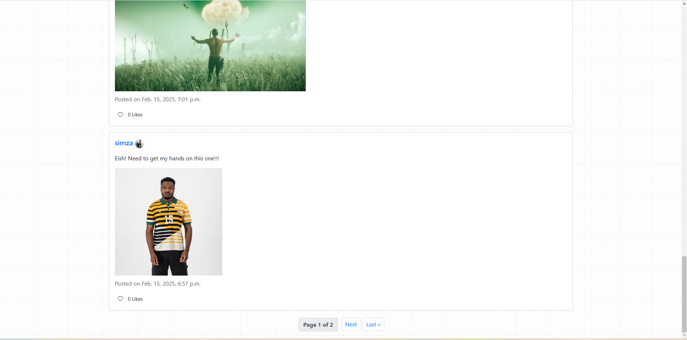

# Network - A Social Media Web App

## Description
Network is a social media web application that allows users to create posts, follow other users, like posts, and edit their own content. The app features an intuitive user interface with a focus on user interaction, profile management, and pagination for seamless navigation.

## Features
- **User Authentication**: Sign up, log in, and log out functionality.
- **Create Posts**: Users can create posts with text and images.
- **Like & Unlike Posts**: Users can like/unlike posts made by others.
- **Edit Posts**: Users can edit their own posts.
- **Follow Users**: Users can follow/unfollow others to see their posts.
- **Profile Pages**: Each user has a profile page showing their posts and follower/following counts.
- **Pagination**: Posts are paginated, displaying 10 posts per page.
- **Search Functionality**: Users can search for other users or posts.
- **Profile Pictures**: Users can upload a profile picture, with a default avatar if none is uploaded.

## Technologies Used
- **Frontend**: HTML, CSS (Bootstrap), JavaScript
- **Backend**: Django
- **Database**: MySQL

## Installation
1. Clone the repository:
   ```bash
   git clone https://github.com/your-username/network.git
   cd network
   ```
2. Create a virtual environment and activate it:
   ```bash
   python -m venv venv
   source venv/bin/activate  # On Windows use: venv\Scripts\activate
   ```
3. Install dependencies:
   ```bash
   pip install -r requirements.txt
   ```
4. Set up the MySQL database and configure `settings.py` accordingly:
   ```python
   DATABASES = {
       'default': {
           'ENGINE': 'django.db.backends.mysql',
           'NAME': 'your_database_name',
           'USER': 'your_database_user',
           'PASSWORD': 'your_database_password',
           'HOST': 'localhost',
           'PORT': '3306',
       }
   }
   ```
5. Apply database migrations:
   ```bash
   python manage.py migrate
   ```
6. Create a superuser:
   ```bash
   python manage.py createsuperuser
   ```
7. Start the development server:
   ```bash
   python manage.py runserver
   ```
8. Access the app at `http://127.0.0.1:8000/`.

## Usage
- Create an account or log in.
- Make posts with text and images.
- Follow users to see their posts on the “Following” page.
- Like, edit, or delete your posts.
- Visit user profiles to see their posts and follow/unfollow them.

## To-Do
- Improve form styling for a more polished user experience.
- Enable post deletion from the front-end.
- Display "(Edited)" in the timestamp if a post has been modified.

## License
This project is open-source and available under the [MIT License](LICENSE).

## Author
Developed by Simphiwe.

## Acknowledgments
This project is part of the CS50W course by Harvard University.

## Screenshots

### Landing Page


### Landing Page (Extended)
.png)

### 3rd_Party_Profile Page


### Own Profile Page


### Search


### Pagination


